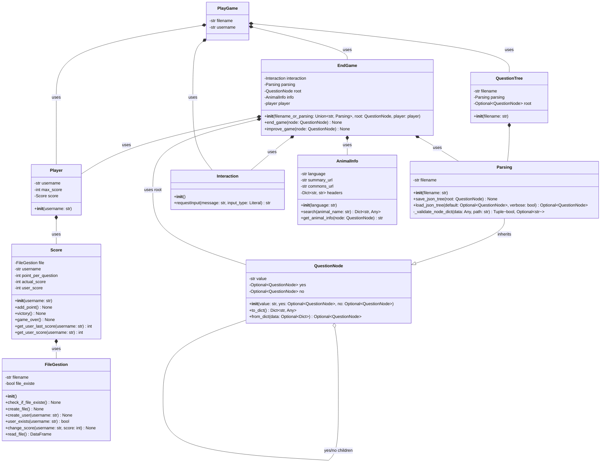

# Oracle_Project

Créer une base de connaissances initiale sous forme d’arbre binaire de décision afin que l’oracle puisse deviner les objets.

# The idea in plain words

The program is a binary decision tree: each node is either a question (internal node) or an answer/guess (leaf node).
Each question node has two children: a yes branch and a no branch.

<div align="center">
  
</div>
<div align="center"> Figure 1: Initial tree diagram </div>

When you play, the program starts at the root and asks the question stored there. Your yes/no answer chooses the next node (yes → yes child, no → no child). If it reaches a leaf it proposes an answer (e.g. "Is it a Turtle?").

If the program is wrong, you teach it a new question and the correct animal; the program replaces that leaf with a new question node and two leaves (one with the correct animal, one with the old wrong guess).

The entire tree is converted to a nested JSON object and saved to disk (for example animals_tree.json). On startup the program loads that JSON and rebuilds the tree. That's how learning persists.

# Features

- 🎮 **Interactive Game**: Play the classic 20 Questions game with an AI oracle
- 🧠 **Self-Learning**: The program learns from its mistakes and improves over time
- 💾 **Persistent Knowledge**: The decision tree is saved to JSON and persists between sessions
- 🌐 **Wikipedia Integration**: Get interesting facts and images about animals from Wikipedia
- 🏆 **Score Tracking**: Earn points for victories and track your performance across sessions
- 👤 **User Profiles**: Individual usernames with persistent score history
- 🖥️ **Two Modes**:
  - Command-line interface for terminal gameplay
  - Streamlit web interface for a modern UI experience
- 🧪 **Comprehensive Testing**: Unit tests and E2E tests with Selenium

# Installation

```bash
pip install -r requirements.txt
```

# Usage

## Command Line Version

Run the game from the terminal with your username:

```bash
python main.py data/animals_tree.json <username>
```

Example:

```bash
python main.py data/animals_tree.json player1
```

## Streamlit Web Version

Launch the web interface:

```bash
streamlit run streamlit.py data/animals_tree.json
```

Then open your browser to the URL shown (typically http://localhost:8501). You'll be prompted to enter your username before playing.

# How to Play

1. **Start**: Enter your username (web version) or provide it as a command-line argument
2. **Think**: Think of an animal
3. **Answer**: Answer the questions with **true** or **false** (CLI) or **Yes** / **No** (web)
4. **Guess**: The oracle will try to guess your animal
5. **Victory**: If it guesses correctly:
   - You earn points (10 per question answered)
   - See information and images about the animal from Wikipedia
6. **Learn**: If it's wrong:
   - You lose points equal to what you would have earned
   - Teach it by providing:
     - The correct animal name
     - A distinguishing question
     - The answer to that question for your animal

# Scoring System

- **Points per Question**: 10 points for each question answered
- **Victory**: Earn all accumulated points (e.g., 5 questions = 50 points)
- **Defeat**: Lose all accumulated points for that game
- **Persistence**: Scores are saved to [`scoring.csv`](scoring.csv) and persist between sessions
- **Tracking**: View your current session score and total score in the sidebar (web) or at game end (CLI)

# Project Structure

```
Oracle_Project/
├── main.py                      # Entry point for CLI version
├── streamlit.py                 # Streamlit web interface
├── data/
│   ├── animals_tree.json        # Saved decision tree data
│   └── parsing.py               # Parsing class - JSON serialization
├── game/
│   ├── question_tree.py         # QuestionTree class - manages the decision tree
│   ├── question_node.py         # QuestionNode class - tree node structure
│   ├── interaction.py           # Interaction class - user input handling
│   ├── end_game.py              # EndGame class - win/lose logic and learning
│   └── player.py                # player class - player management
├── scoring/
│   ├── score.py                 # Score class - score tracking logic
│   └── file_gestion.py          # FileGestion class - CSV operations
├── api/
│   └── animal_info.py           # AnimalInfo class - Wikipedia API integration
├── unit_test/
│   ├── test.py                  # Unit tests for QuestionNode
│   └── test_parsing_cases.py   # Unit tests for Parsing edge cases
├── e2e_test/
│   └── test.py                  # End-to-end tests with Selenium
├── scoring.csv                  # Score persistence file
├── requirements.txt             # Python dependencies
└── README.md                    # This file
```

# Architecture

## Core Classes

### QuestionNode ([`game/question_node.py`](game/question_node.py))

- Represents a node in the binary decision tree
- Can be either a question (internal node) or an animal (leaf node)
- Has `yes` and `no` child pointers
- Supports serialization to/from dictionaries for JSON storage via [`to_dict()`](game/question_node.py) and [`from_dict()`](game/question_node.py)

### QuestionTree ([`game/question_tree.py`](game/question_tree.py))

- Main tree structure
- Loads the tree from JSON file on initialization using [`Parsing`](data/parsing.py)
- Strict mode: raises error if file cannot be loaded

### Parsing ([`data/parsing.py`](data/parsing.py))

- Handles saving and loading the decision tree to/from JSON
- Converts between QuestionNode objects and dictionary representations
- Validates tree structure before loading
- Supports default fallback values and verbose error reporting

### Player ([`game/player.py`](game/player.py))

- Represents a player with a username
- Manages player's score through the [`Score`](scoring/score.py) class
- Links player identity to score persistence

### Score ([`scoring/score.py`](scoring/score.py))

- Tracks points during gameplay
- Awards 10 points per question answered
- Handles victory (adds points) and defeat (subtracts points)
- Retrieves user scores from CSV via [`FileGestion`](scoring/file_gestion.py)

### FileGestion ([`scoring/file_gestion.py`](scoring/file_gestion.py))

- Manages the [`scoring.csv`](scoring.csv) file
- Creates users if they don't exist
- Tracks both last game score and cumulative total score
- Appends new entries for each game played

### Interaction ([`game/interaction.py`](game/interaction.py))

- Validates user input in CLI mode
- Supports different input types (boolean, string)
- Provides input retry on invalid responses

### EndGame ([`game/end_game.py`](game/end_game.py))

- Handles the endgame scenarios
- Shows Wikipedia information on correct guesses
- Implements the learning mechanism when wrong
- Updates and saves the tree with new knowledge
- Records victory/defeat in player's score

### AnimalInfo ([`api/animal_info.py`](api/animal_info.py))

- Fetches animal information from Wikipedia API
- Retrieves summaries, thumbnails, and additional images
- Provides educational content on successful guesses
- Filters image types for better display

# How Learning Works

When the oracle makes an incorrect guess:

1. You provide the correct animal name
2. You create a distinguishing question that separates your animal from the oracle's guess
3. You specify the answer to that question for your animal
4. The oracle creates a new question node with:
   - Your question as the node value
   - Two children: the correct animal and the wrong guess
   - Branches assigned based on your answer

The updated tree is immediately saved to [`data/animals_tree.json`](data/animals_tree.json), so the knowledge persists for future games.

# System Architecture Diagrams

## General System Flow

```
┌─────────────┐
│   User      │
└──────┬──────┘
       │
       ▼
┌────────────────────────────────────────────┐
│  Interface Layer                           │
│  ┌────────────┐      ┌──────────────┐      │
│  │  main.py   │      │ streamlit.py │      │
│  │    (CLI)   │      │    (Web)     │      │
│  └─────┬──────┘      └──────┬───────┘      │
└────────┼────────────────────┼──────────────┘
         │                    │
         │                    │
         └─┐                  │
┌──────────▼──────────┐       │
│   PlayGame          │       │
│ (Game Logic)        │       │
└──────────┬──────────┘       │
           └────────┐─────────┘
         ┌──────────▼──────────┐
         │   Player            │
         │ (Player Management) │
         └──────────┬──────────┘
                    │
                    ├────────────────────┐
                    │                    │
         ┌──────────▼──────────┐  ┌──────▼───────┐
         │   QuestionTree      │  │ Interaction  │
         │                     │  │ (Input       │
         │   ┌────────┐        │  │  Validation) │
         │   │ Parsing│◄───────┼──┤              │
         │   └───┬────┘        │  └──────────────┘
         │       │             │
         │   ┌───▼────┐        │
         │   │  JSON  │        │
         │   │  File  │        │
         │   └────────┘        │
         │       │             │
         │   ┌───▼──────────┐  │
         │   │ QuestionNode │  │
         │   │  (Binary     │  │
         │   │   Tree)      │  │
         │   └──────────────┘  │
         └──────────┬──────────┘
                    │
         ┌──────────▼──────────┐
         │     EndGame         │
         │  (Victory/Defeat    │
         │   & Learning)       │
         └──────────┬──────────┘
                    │
         ┌──────────▼──────────┐
         │   AnimalInfo        │
         │  (Wikipedia API)    │
         └─────────────────────┘
```

## Scoring System Flow

```
┌──────────────────────────────────────────────┐
│           Game Session Start                 │
└──────────────────┬───────────────────────────┘
                   │
        ┌──────────▼──────────┐
        │      player         │
        │  - username         │
        └──────────┬──────────┘
                   │
                   │ creates
                   │
        ┌──────────▼──────────┐
        │       Score         │
        │  - actual_score: 0  │
        │  - user_score       │
        └──────────┬──────────┘
                   │
                   │ initializes
                   │
        ┌──────────▼──────────┐
        │csv_score_repository │
        │  - scoring.csv      │
        └──────────┬──────────┘
                   │
                   │ checks user exists
                   │ retrieves user_score
                   │
        ┌──────────▼──────────────────────┐
        │     During Game                 │
        │  Each Question Asked:           │
        │    score.add_point()            │
        │    actual_score += 5            │
        └──────────┬──────────────────────┘
                   │
                   │
        ┌──────────▼──────────────────────┐
        │     Game End                    │
        │                                 │
        │  Victory:                       │
        │    score.victory()              │
        │    user_score += actual_score   │
        │                                 │
        │  Defeat:                        │
        │    score.game_over()            │
        │    user_score -= actual_score   │
        └──────────┬──────────────────────┘
                   │
                   │ persists
                   │
        ┌──────────▼──────────────────────┐
        │ csv_score_repository            │
        │  - change_score()               │
        │  - Updates scoring.csv:         │
        │    username | last_score |      │
        │             | score_total       │
        └─────────────────────────────────┘
```

## Scoring System Data Flow

**Initialization:**

1. `player` creates a `Score` instance with username
2. `Score` creates a `FileGestion` instance
3. `FileGestion` checks if `scoring.csv` exists (creates if not)
4. `FileGestion` verifies user exists (creates entry if not)
5. `Score` retrieves cumulative `user_score` from CSV

**During Gameplay:**

- Each question: `Score.add_point()` → `actual_score += 5`
- Session score accumulates throughout the game

**Game Conclusion:**

- **Victory:** `Score.victory()` → `user_score + actual_score` → saved to CSV
- **Defeat:** `Score.game_over()` → `user_score - actual_score` → saved to CSV
- New entry added to CSV with `last_score` and updated `score_total`

# Example Game Flow

## Victory Scenario

```
Welcome to the 20 Questions Game!
Think of an animal, and I'll guess it.
Does it have fur? (true/false) true
Does it bark? (true/false) false
Does it miaow? (true/false) true
Is it a Cat? (true/false) true
Yay! I guessed it right!
Here some infos about this animal from Wikipedia :

Summary: The cat is a domestic species of small carnivorous mammal...
Pics: https://upload.wikimedia.org/...

✅ Victory! You earned 30 points!

Game Over, player1!
Your score: 30
Total score: 130
```

## Learning Scenario

```
Is it a Horse? (true/false) false
Oh no! What was your animal? Lion
Give me a question that distinguishes a Lion from a Horse: Is it a wild animal?
For a Lion, what is the answer to your question? (true/false) true
Got it! I'll remember that for next time.
Tree saved successfully.

❌ Game Over! You lost 50 points!
```

# Testing

## Unit Tests

Run the QuestionNode tests:

```bash
python unit_test/test.py
```

Run the Parsing edge case tests:

```bash
python unit_test/test_parsing_cases.py
```

## End-to-End Tests

The E2E tests use Selenium to test the Streamlit interface. First, start the Streamlit app:

```bash
streamlit run streamlit.py
```

Then run the E2E tests in another terminal:

```bash
python e2e_test/test.py
```

The E2E tests cover:

- Known animal guessing (Dog, Cat)
- New Game button functionality
- Teaching new animals to the system

# API Integration

The project uses the **Wikipedia REST API** to fetch:

- Text summaries of animals
- Thumbnail images
- Additional images from Wikimedia Commons

API endpoints:

- Summary: `https://en.wikipedia.org/api/rest_v1/page/summary/{animal_name}`
- Images: `https://commons.wikimedia.org/w/api.php`

# Data Persistence

## Tree Data

The decision tree is stored in [`data/animals_tree.json`](data/animals_tree.json) as a nested JSON structure representing the binary tree.

## Score Data

Player scores are stored in [`scoring.csv`](scoring.csv) with the following columns:

- `username`: Player identifier
- `last_score`: Score from the most recent game (positive for win, negative for loss)
- `score_total`: Cumulative score across all games

Each game creates a new row in the CSV, allowing for score history tracking.

# UML Class Diagram



This diagram represents the complete class structure of the Oracle Project, showing:

- **Inheritance**: `Parsing` extends `QuestionNode` to add serialization capabilities
- **Composition**: Strong containment relationships (filled diamonds)
- **Aggregation**: Weak containment relationships (empty diamonds)
- **Dependencies**: Usage relationships (dotted arrows)

Key architectural patterns:

- **Binary Tree Pattern**: `QuestionNode` forms a recursive tree structure
- **Strategy Pattern**: `Interaction` handles different input validation strategies
- **Repository Pattern**: `FileGestion` manages data persistence
- **Facade Pattern**: `EndGame` coordinates multiple subsystems for game conclusion
